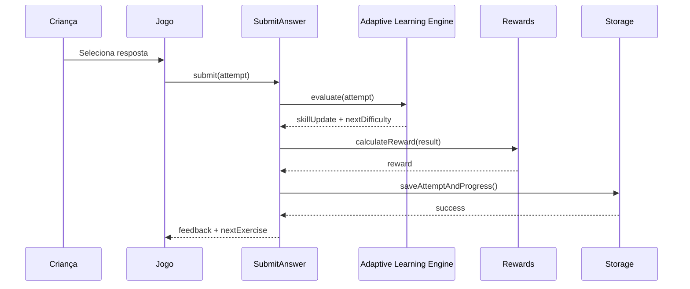

# Fluxo de resposta

```mermaid
sequenceDiagram
    participant C as Criança
    participant UI as Jogo
    participant UC as SubmitAnswer
    participant ALE as Adaptive Learning Engine
    participant R as Rewards
    participant DB as Storage

    C->>UI: Seleciona resposta
    UI->>UC: submit(attempt)
    UC->>ALE: evaluate(attempt)
    ALE-->>UC: skillUpdate + nextDifficulty
    UC->>R: calculateReward(result)
    R-->>UC: reward
    UC->>DB: saveAttemptAndProgress()
    DB-->>UC: success
    UC-->>UI: feedback + nextExercise
```
