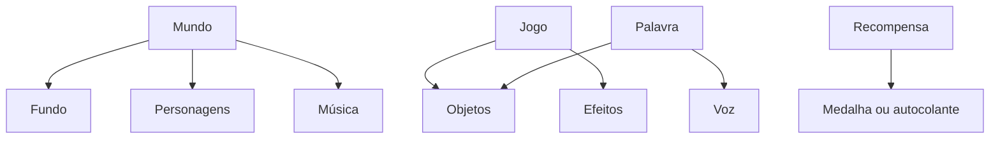

# Relações entre assets

```mermaid
flowchart TD
    World[Mundo] --> Background[Fundo]
    World --> Character[Personagens]
    World --> Music[Música]
    Game[Jogo] --> Object[Objetos]
    Game --> Audio[Efeitos]
    Word[Palavra] --> Object
    Word --> Voice[Voz]
    Reward[Recompensa] --> Badge[Medalha ou autocolante]
```
