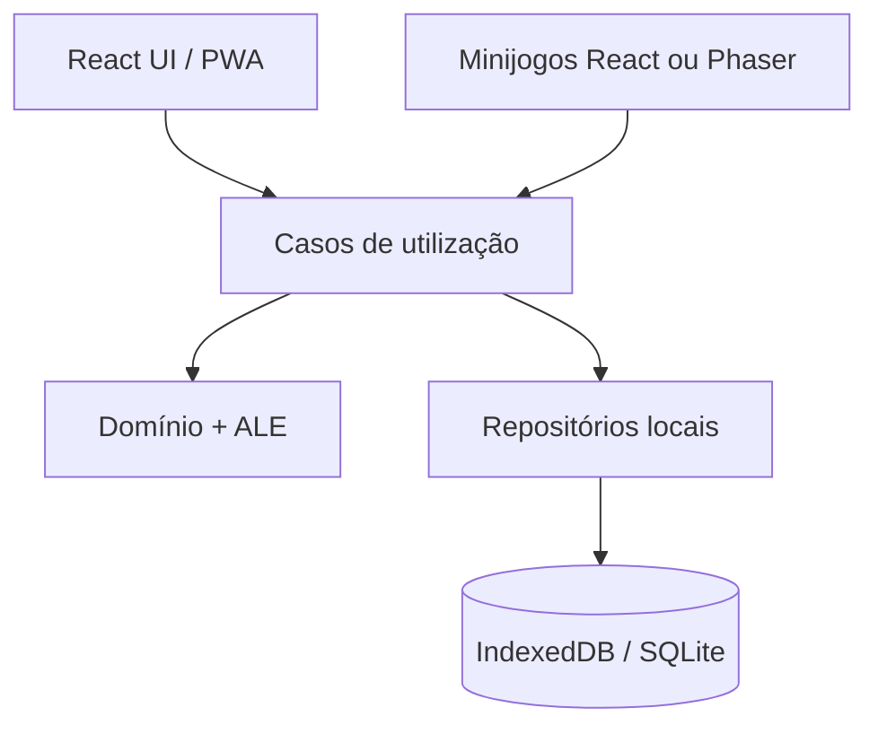

# C4 — Contentores

```mermaid
flowchart TB
    UI[React UI / PWA]
    Games[Minijogos React ou Phaser]
    App[Casos de utilização]
    Domain[Domínio + ALE]
    Storage[Repositórios locais]
    DB[(IndexedDB / SQLite)]
    UI --> App
    Games --> App
    App --> Domain
    App --> Storage
    Storage --> DB
```
