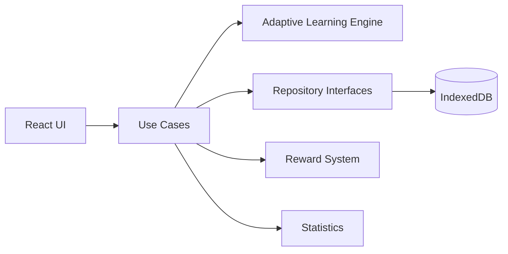

# MVP Data Flow

```mermaid
flowchart LR
    UI[React UI] --> UC[Use Cases]
    UC --> ALE[Adaptive Learning Engine]
    UC --> Repo[Repository Interfaces]
    Repo --> DB[(IndexedDB)]
    UC --> Rewards[Reward System]
    UC --> Stats[Statistics]
```
