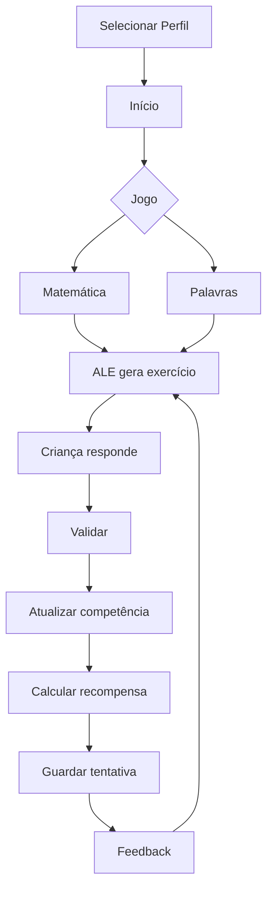

# MVP System Flow

```mermaid
flowchart TD
    A[Selecionar Perfil] --> B[Início]
    B --> C{Jogo}
    C --> D[Matemática]
    C --> E[Palavras]
    D --> F[ALE gera exercício]
    E --> F
    F --> G[Criança responde]
    G --> H[Validar]
    H --> I[Atualizar competência]
    I --> J[Calcular recompensa]
    J --> K[Guardar tentativa]
    K --> L[Feedback]
    L --> F
```
