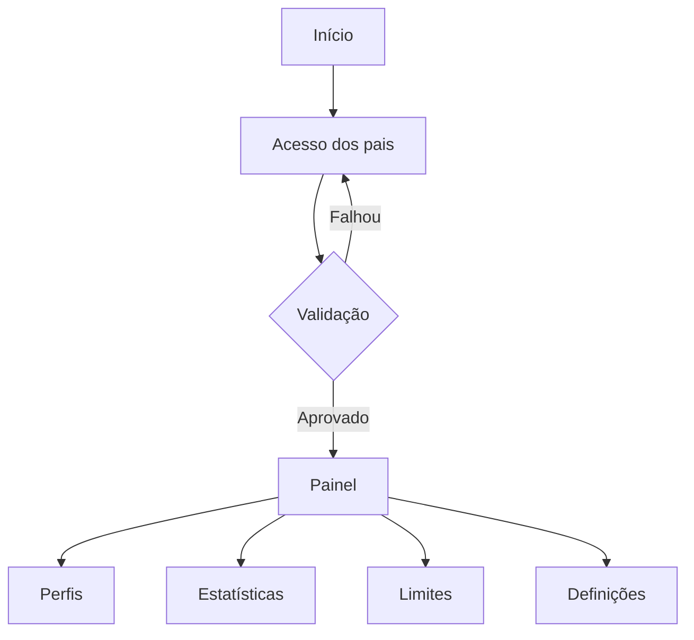

# Fluxo da área dos pais

```mermaid
flowchart TD
    A[Início] --> B[Acesso dos pais]
    B --> C{Validação}
    C -->|Aprovado| D[Painel]
    C -->|Falhou| B
    D --> E[Perfis]
    D --> F[Estatísticas]
    D --> G[Limites]
    D --> H[Definições]
```
