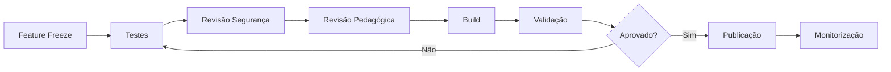

# Fluxo de release

```mermaid
flowchart LR
    A[Feature Freeze] --> B[Testes]
    B --> C[Revisão Segurança]
    C --> D[Revisão Pedagógica]
    D --> E[Build]
    E --> F[Validação]
    F --> G{Aprovado?}
    G -->|Não| B
    G -->|Sim| H[Publicação]
    H --> I[Monitorização]
```
